# 🪄 Grimorium: The Dynamic Spellbook for AI Agents

[](https://badge.fury.io/py/grimorium)
[](https://opensource.org/licenses/MIT)

**Grimorium** is a powerful library that allows your AI agents to dynamically discover and load new tools—or "spells"—on the fly. Inspired by the principles of active tool discovery outlined in the [MCP-Zero research paper](https://arxiv.org/html/2506.01056v4), Grimorium transforms agents from passive tool users into active problem-solvers that can identify their own capability gaps and request new abilities in real-time.

## ✨ Why Grimorium?

Traditional agent frameworks often rely on providing all available tools in the agent's context, leading to significant overhead. Grimorium's approach, similar to that of MCP-Zero, offers substantial benefits:

* **Massive Context Reduction:** By only loading tools as they are needed, this framework can reduce token consumption by up to **98%** compared to traditional methods. This leads to faster response times and lower operational costs.
* **Improved Scalability & Accuracy:** This approach maintains high tool-selection accuracy even with a vast collection of tools. The MCP-Zero paper demonstrated this with a dataset of over 2,700 tools, a scale where traditional methods suffer from attention dilution.
* **Enhanced Autonomy:** Agents become more autonomous and adaptable, capable of tackling complex, multi-domain tasks by building their own toolchains on the fly.

## Key Features

* **Dynamic Tool Loading:** Agents can request and load new tools at runtime without interrupting their workflow.
* **Semantic Search:** Uses vector embeddings to find the most relevant tool for a given task based on natural language descriptions.
* **Extensible:** Easily add new "spells" to the agent's repertoire by simply writing a Python function with a descriptive docstring.
* **Seamless Integration:** Designed for the `google.adk` framework, but the concepts are portable to other agent-based systems.
* **Modern Architecture:** Built with a clean, modular design, using modern Python features like type hints.

## Core Components

* **`Grimorium`:** The main orchestrator. It injects a specialized "grimorium" agent as a tool into the main agent and uses an `after_tool_callback` to trigger the spell discovery and loading process.
* **`SpellSync`:** The engine for the semantic search. It loads a pre-computed list of spells and their embeddings, generates embeddings for user queries, and calculates the cosine similarity to find the best match.
* **`tools.py`:** The spellbook itself. A module containing the Python functions ("spells") that can be loaded.
* **`tools_embeddings.json`:** A pre-computed database of the spells, containing their names, docstrings, and docstring embeddings.

## ⚙️ How It Works

Grimorium's functionality is split into two main phases: an offline "spell synchronization" phase (for developers) and an online "spell discovery" phase (at runtime).

### Offline: Spell Synchronization

This phase is about preparing the spellbook (`tools_embeddings.json`) for the agent to use.

1. **Spell Creation**: A developer defines a standard Python function in any file. This function is the "spell."
2. **Spell Registration**: The developer imports the `register_spell` decorator from `grimorium.spell_registry` and applies it to the function. This adds the spell to a central registry.
3. **Synchronization**: The developer runs the command `uv run -m grimorium.spellsync`. This script:
   * Discovers all functions decorated with `@register_spell`.
   * For each spell, it generates a vector embedding of its docstring using a Google embedding model.
   * It saves the spell's name, docstring, and the generated embedding into the `tools_embeddings.json` file.

This process creates a pre-computed, searchable index of all available spells.

### Online: Spell Discovery & Loading

This is what happens in real-time when your agent is running.

1. **Initialization**: Your application creates a main agent and passes it to the `Grimorium` class. The `Grimorium` class then:
   * Creates a special-purpose `grimorium` agent, which is a tool itself.
   * Injects this `grimorium` tool into the main agent's toolset.
   * Registers an `after_tool_callback` (`_discover_best_spell`) on the main agent.
2. **The Request**: A user asks the main agent to do something for which it has no tool (e.g., "What's the weather?").
3. **The Spell Request**: The main agent, guided by its initial instructions, uses the `grimorium` tool. It passes a natural language description of the tool it needs (e.g., "I need a spell to get the current weather").
4. **The Discovery**: The `_discover_best_spell` callback is triggered. It takes the agent's description and passes it to the `SpellSync.match()` method.
5. **The Matching**: The `SpellSync` engine:
   * Generates a vector embedding for the agent's request.
   * Calculates the cosine similarity between the request embedding and all the pre-computed spell embeddings in `tools_embeddings.json`.
   * Identifies the spell with the highest similarity score as the best match.
6. **The Learning**: The name of the best-matching spell is returned to the `_discover_best_spell` callback. It then:
   * Retrieves the actual Python function from the `spell_registry`.
   * Dynamically appends the function to the main agent's `tools` list.
7. **The Execution**: The `Grimorium` sends a message back to the agent confirming that the spell has been added (e.g., `[SPELL_ADDED] Successfully added: weather_forecast`). The agent can now use the newly acquired tool to fulfill the user's original request.

```mermaid
graph TD
    subgraph Offline
        A[Developer writes Python function] --> B[Decorates with @register_spell];
        B --> C[Runs 'uv run -m grimorium.spellsync'];
        C --> D[tools_embeddings.json is created/updated];
    end

    subgraph Online
        E[User: 'What's the weather?'] --> F{Agent lacks tool};
        F --> G[Agent uses Grimorium tool: 'I need a weather spell'];
        G --> H[Grimorium's `after_tool_callback` is triggered];
        H --> I[SpellSync compares request to `tools_embeddings.json`];
        I --> J[Finds `weather_forecast` spell];
        J --> K[Grimorium loads `weather_forecast` function into agent's toolset];
        K --> L[Agent is notified: 'Spell Added'];
        L --> M[Agent uses `weather_forecast` tool];
        M --> N[Agent provides the weather];
    end
```



## 🚀 Getting Started

### Installation

```bash
uv add grimorium
```

### Basic Usage

```python
from google.adk.agents import Agent
from grimorium import Grimorium

# 1. Create your main agent
main_agent = Agent(
    name="main_agent",
    model="gemini-2.0-pro",
    instruction="You are a helpful assistant. If you need a new tool, ask the Grimorium for it."
)

# 2. Give it the Grimorium
# This will automatically equip your agent with the ability to learn new spells.
grimoire = Grimorium(main_agent=main_agent)

# 3. Interact with the agent
# The agent will now automatically use the Grimorium to find and load tools
# when it needs them to answer user queries.
# (See the example/ directory for a full implementation)
```

## 📖 Adding New Spells

To add a new spell to your Grimorium, you need to perform two steps:

1. **Define and Register the Spell**: Create a Python function anywhere in your project. It must have a clear, descriptive docstring and be decorated with `@register_spell`.

    ```python
    # example/tools.py
    from grimorium import register_spell

    @register_spell
    def get_stock_price(ticker: str) -> dict:
        """
        Retrieves the current stock price for a given ticker symbol.

        Args:
            ticker: The stock ticker symbol (e.g., "GOOGL").

        Returns:
            A dictionary with the stock price information.
        """
        # Your implementation here...
        return {"price": 150.0}
    ```

2. **Update the Embeddings**: Run the synchronization script from your terminal. This will find your new spell, generate its embedding, and add it to the spellbook.

    ```bash
    uv run -m grimorium.spellsync
    ```

## 🔧 Configuration

Grimorium is designed to be configurable via a `config.yaml` file in `~/.grimorium/`. However, this configuration system is still under development and not yet fully implemented.

## 🗺️ Roadmap

* [ ] **Dynamic Spell Reset:** A mechanism to decide when to unload spells that are no longer needed.
* [ ] **Richer Built-in Spells:** A more comprehensive set of default spells.
* [ ] **Full Configuration Support:** Complete the implementation of the `config.yaml`-based configuration system.
* [ ] **Improved Error Handling:** More robust error handling for cases where spells fail to load or execute.

## 🤝 Contributing

Contributions are welcome! Please feel free to submit a pull request or open an issue.

## 📜 License

This project is licensed under the MIT License - see the [LICENSE](LICENSE) file for details.
